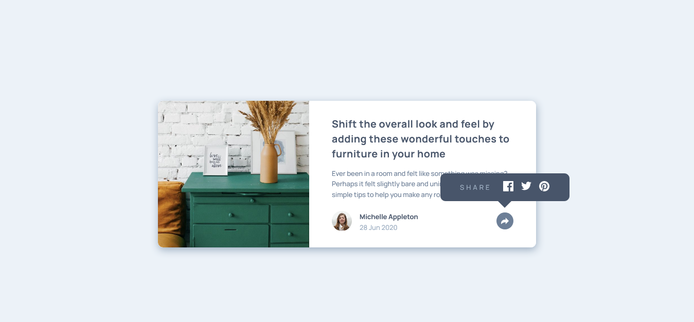

# Frontend Mentor - Article preview component solution

This is a solution to the [Article preview component challenge on Frontend Mentor](https://www.frontendmentor.io/challenges/article-preview-component-dYBN_pYFT). Frontend Mentor challenges help you improve your coding skills by building realistic projects! 

## Table of contents

- [Overview](#overview)
  - [The challenge](#the-challenge)
  - [Screenshot](#screenshot)
  - [Links](#links)
- [My process](#my-process)
  - [Built with](#built-with)
  - [What I learned](#what-i-learned)
  - [Continued development](#continued-development)
  - [Useful resources](#useful-resources)
- [Author](#author)

## Overview

### The challenge

Users should be able to:

- View the optimal layout for the component depending on their device's screen size
- See the social media share links when they click the share icon

### Screenshot

Desktop view



### Links

- Solution URL: [Click here](https://www.frontendmentor.io/solutions/mobile-first-html-scss-flexbox-javascript-D33RIlzO7)
- Live Site URL: [See live site here](https://juanbonilla.me/FEM_article-preview-component/)

## My process

### Built with

- Semantic HTML5 markup
- CSS / SCSS custom properties
- Flexbox
- JavaScript
- Mobile-first workflow

### What I learned

In this opportunity I was able to search for different ways to toggle between CSS classes in JavaScript. So, I was using code that was large in comparison with the final result. In this case I found really useful this ```.classList.toggle()``` function to solve my problem in a better and readable manner. 

```js
const toggleClass = () => {
  const width = document.documentElement.clientWidth;
    
  if (width < 1024) {
      profileSection.classList.toggle(`${parentElement}--active`);
      profileContainer.classList.toggle(`${parentElement}__container--active`);
      authorDiv.classList.toggle(`${parentElement}__author--hidden`);
  }
  //More code...
}
```

### Continued development

I want to continue discovering different functions that already exist and include them in other projects. Also, I will playing more with CSS Transitions and understanding use cases to implement them.

### Useful resources

- [What the heck are pseudo elements in CSS?](https://www.youtube.com/watch?v=wHY02FpNYnU) - This helped me when I was thinking about how I could create an arrow to indicate where my 'share' bubble was coming from.
- [Transitions on the CSS display property](https://stackoverflow.com/questions/3331353/transitions-on-the-css-display-property) - This is a resource I found useful to insert a transition when the user clicks on the arrow icon and make the 'share' bubble appear.

## Author

- Website - [juanbonilla.me](https://juanbonilla.me)
- Frontend Mentor - [@juanpb96](https://www.frontendmentor.io/profile/juanpb96)
- LinkedIn - [Juan Bonilla](https://www.linkedin.com/in/juan-pablo-bonilla-6b8730115/)
